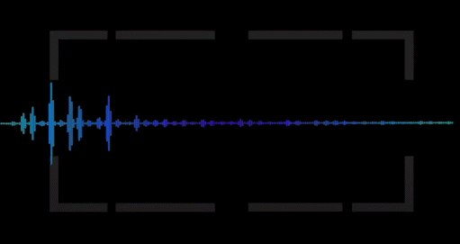

# Audio & Speech Tutorial

This repository contains a short introduction on the topic of audio and speech processing, from the very basics to the numerous applications. 

You can open the notebook directly in colab here: 

  

This notebook briefly shows:
- What is a sound and how do we represent it digitally
- How we prepare audio data for a deep learning model
- Time Domain vs Frequency Domain
- Spectrum and Spectrograms 
- Data Augmentation Techniques
- Deep Learning Models with some examples
  - Speaker Identification
  - Emotion Recognition
  - Intent Classification
  - Keyword Spotting
  - Speech-to-Text
  - Text-to-Speech
  - Music Generation
  

If you want to get in touch with me, you can send me an email at [alkis.koudounas@polito.it](mailto:alkis.koudounas@polito.it?subject=[Speech%20-%20Audio]%20Request%20further%20information).
